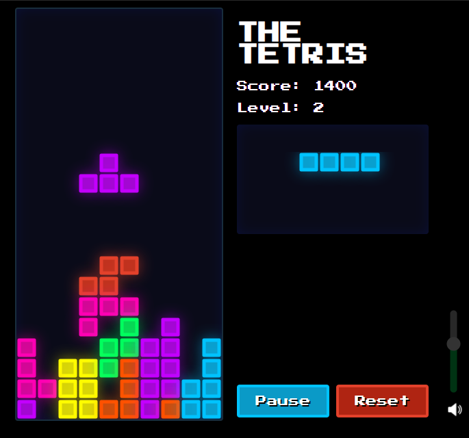
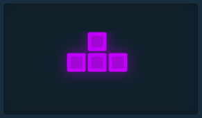
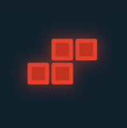

# Tetris

[]()
[](https://medium.com/@alaurentinoofficial/tetris-utilizando-canvas-e-javascript-43a082556ba5
)

<br>
<br>
<br>

## Link to Play

https://thetetris.herokuapp.com

<br>



<br>
<br>
<br>

# E2E Tests using Cypress

#### 1. Start the local server
```sh
> npm install

> npm start
```

#### 2. Run the tests using the command bellow:
```sh
> npx cypress run
```

<br>

#### Description:

- `should open the site`: Test if the site server is available
- `should start`: The game should start right after click on play button, to pass the game state need to be "gaming"
- `should pause`: The game should pause right after click on pause button, to pass the game state need to be "pause"
- `should reset`: The game should pause right after click on reset button, to pass the game state need to be "stoped"
- `should change game volume`: Check if is possible change the value of music volume in game
- `should game over`: Test if the game ends after all pieces fall for some time, to pass the game over model should pop up and the model have the class "active"

<br>
<br>
<br>

# How to play

### The Pieces

| Name | Representation         |
|------|------------------------|
| I    |    |
| O    |    |
| S    |    |
| Z    |    |
| L    |    |
| J    |    |
| T    |    |

<br>
<br>
<br>

## Scoring at game

1. To get score it's necessary fill a entire line with any piece or position.
Like the image represented below:

<br>


<br>

2. After fill the line it blow up and all pieces above came down:

<br>


3. And adds 100 to the score:

<br>


<br>
<br>
<br>

## Movements

> You can control new pieces that appear on the top and choise where the piece goes to fix, when the piece colide below of the ground or another piece, the actual piece gets rooted and new piece appear in the top 

<br>

- `Rotate`  the piece it's easy using the up arrow (↑)




<br>

- `Move`  the piece it's easy using the left arrow (←) to go left or right arrow (→) to go right


<br>

- `Accelerate` the peice start to fall more fast 


<br>
<br>
<br>

## Game Over

> The game over after to fill any collumns, being impossible to put another piece on the map


<br>
<br>
<br>

# Developed by
* Anderson Laurentino ([alaurentinoofficial](https://github.com/alaurentinoofficial))
* Jackson Matheus ([JacksonMaths](https://github.com/JacksonMaths))
* João Matheus ([joaoguedesmg](https://github.com/joaoguedesmg))
* José Helton ([jheltonap](https://github.com/jheltonap))
